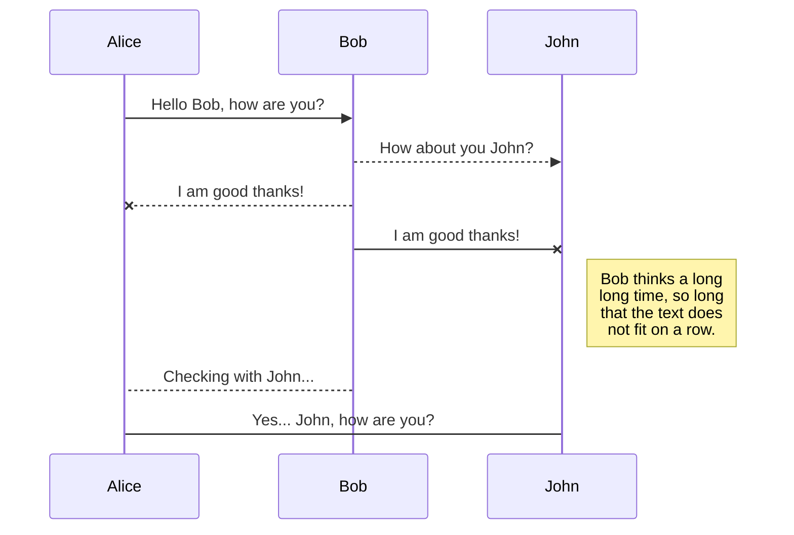

UserNDot is a behavioural analytics platform that increases your company's business growth by increasing your user engagement. 
UserNDot helps you increase your user engagement in three ways 
You can track actions performed by users on your website to analyze how people use your product.
You can segment users based on their actions or attributes and run campaigns to these segments to engage accordingly with different type of users.
You can analyze each of your campaigns to understand their impact on user engagement and your business metrics.


## Features Of UserNDot

### Save User Details

UserNDot will create a user profile for each person who visits your company’s website. A UserNDot user profile has a set of default fields, such as first name, last name, email, mobile number, and language. 

You can also create your own custom fields according to your business requirements. For example, if you offer streaming songs in your app, you can create a custom profile field to track what type of genre the user is interested in.

You have the option to save user properties as soon as the user is tracked. 

The events in the session are automatically assigned to the user profile of the users when the user is tracked.

Types of User profile 

There are 3 types of user profiles in UserNDot:

**Anonymous**: Anonymous user profiles don't contain any user identifiable information.

**Addressable**: Addressable user profiles can be reached via email notifications.

**Customer**: When you record a purchase via the Charged event, that user will be marked as a Customer.

### Track User Events
Events track actions performed by users on your website. For example viewing a product, adding to cart, making a purchase, streaming a video. Event details are saved to create better segments of users and run targeted campaigns.

By tracking events on your website you can better know what users are doing on your website and can engage with them more effectively.

Event properties are details of events that describe the action taking place. For example, while recording the “Product viewed” event, you could also store event properties like product name, category, and price. Recording event properties will help you answer questions like which category of products are more popular, and help you segment users based on that categories.

In events, event location coordinates can also be saved which can be helpful in segmenting users based on location and personalizing interactions with users according to location of users.

IP Address of the user’s device can also be saved. It can provide additional facts to build an accurate user profile. Once you have a user’s IP, you can begin the process of tying the visit to more personal information about the user. Knowing how individual users behave on your website can influence your advertising campaigns from top to bottom in a way that ultimately benefits your bottom line.

System properties like operating system name, web browser name, user device name, application name and their versions are saved automatically. It can help in creating better segments of users and more effective targeting of the right customers.

You can also track user events irrespective of whether the users are identified or not. As soon as the user is tracked all the events occured in the session are automatically assigned to the user profile of the user. 


## Segmenting Users

Segments are group of users whose behaviours, activities or user profile meet a set of criteria defined by you. You can create segments of users and then run targeted campaigns on these segments to improve user engagement. 

Users can be segmented on the basis of actions performed by users on your company’s website like products added to cart, items added to wishlist, app uninstalled, items charged etc. By segmenting your users in this way, you can start to devise more effective marketing plans to reach each of them according to their behaviour.

Users can be segmented on the basis of location of access or geography. Geographic segmentation allows large companies to target the varying wants and needs of customers in different regions. People living in different geographic regions typically display varying needs, wants, and cultural characteristics that can be specifically targeted for more efficient and better marketing. Geographic segmentation allows small businesses with limited budgets to be more cost effective.

Users can be segmented on the basis of user properties.

Users can be segmented on the basis of demographics. Demographic segmentation allows businesses to separate their target users into specific groups based on gender, age etc. Age is a common form of demographic segmentation as needs of users evolve with age. Gender specific segmentation can also be useful. It can be helpful in personalizing interaction with users according to their gender.

Users can be segmented on the basis of technographics. Technographics contain information about web browser, device and operating system. You can get a lot of valuable information from the dozens of technologies each individual uses.

Segmenting users will help you in targeting the right customers and will improve your company’s user engagement.

You can view the list of all the created segments at one place. You can also view the segment details in human readable form.


## Find Users

With UserNDot you can find users with identities like facebook id, google id, contact number, email id and und id and create campaigns to communicate with them according to the type of identities.

You can find users according to their behaviour. You can also combine multiple behaviours and find users satisfying all of the behaviours using AND operator or any of the behaviours using OR operator.


## Email Notification 

UsernDot provides personalized email notifications to engage with users at the right time and with the personalized content according to the user. You can send email notifications to users to increase your company’s user engagement.

You can track if an email is sent, read or CTA performed. When you create an email marketing campaign, one of the most important components is the call to action or CTA. More CTA’s give users more options, which means increased engagement with your brand.

You can track and mark DND for permanently skipped or spam emails which can reduce your marketing campaign costs.

CTA’s are tracked as events and can be used for further deeper segmentation.


## Email Templates

Most of the marketers spend per campaign a lot of time on content and design. But on complex campaigns that require testing and approval from multiple sources, it can take even more time than that. Email templates let you plug your content into an existing template saving you the time of designing new templates for every new campaign. That means you get to spend more time creating content and less time on tedious design work.

UserNDot enables you to create email templates to send email notifications to your users according to campaigns.

You can edit the previously created templates according to campaigns.

You can view the list of all the created email templates at one place.


## UML diagrams

You can render UML diagrams using [Mermaid](https://mermaidjs.github.io/). For example, this will produce a sequence diagram:



And this will produce a flow chart:

```aidl
graph LR
A[Square Rect] -- Link text --> B((Circle))
A --> C(Round Rect)
B --> D{Rhombus}
C --> D
```

```js
function abc() {
    var a = 1;
}
```